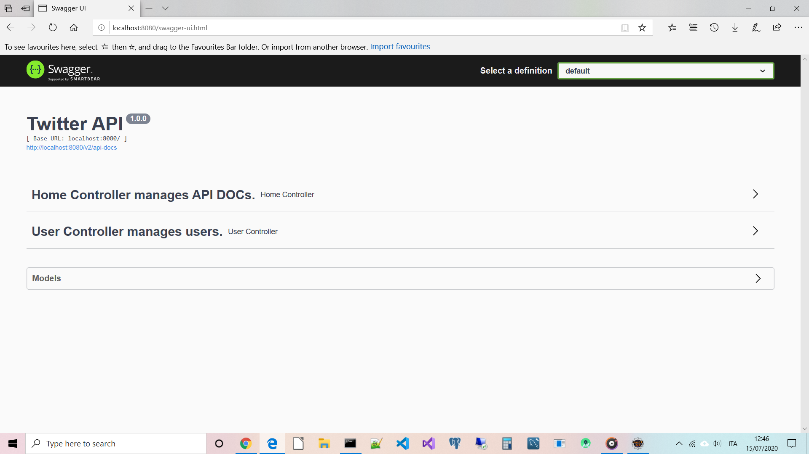

:java_version: current
:spring_version: current
:toc:
:project_id: twitter-api
:icons: font
:source-highlighter: prettify

= Welcome to twitter-api !

Description of the project: twitter-api is a simple Social Network Application in Java 14 similar to Twitter based on a set of APIs exposed to a possible Front-End.

A User is created by sending the first message of up to 140 characters.
Has the ability to follow another Twitter User.
He can also see all his messages written on a Wall in reverse chronological order (from present to past).
Finally, he can read all the messages of those who is following, maintaining a reverse chronological order in a timeline.

[[initial]]
== twitter-api Description

twitter-api is a project based on Java 14 and SpringBoot 2.4 to process the life cycle of a Twitter User and a Twitter Message.

[[initial]]
== Set up Java App

after downloading from git:

- build the project with Maven:

[subs="attributes"]
----
./cd twitter-api
./mvn package && java -jar target/twitter-api-0.0.1-SNAPSHOT.jar
----

then open your favorite browser and enter http://localhost:8080  in the address bar and you can see:

----
----

----
----

'''
'''

== SpringBoot Architecture Description

The Architecture is based on eight main packages:

- 1) An Initializer;
- 2) The Controller Advisors;
- 3) The Assemblers;
- 4) The API REST Controllers;
- 5) The Exceptions;
- 6) The Models;
- 7) The Repositories;
- 8) The Services;

==== Description of the Initializer

[subs="attributes"]
----
package: com.esabatini.twitterapi
----

In the Initializer we have four classes:

- LoadDatabase: has the responsibility of creating the first two Users and inserting them into the Database In-Memory H2;
- Setup: contains configuration constants;
- SpringFoxConfig: initializes a Swagger API Docket;
- TwitterApiApplication: configures and starts the Web Application;

==== Description of the Controller Advisors

[subs="attributes"]
----
package: com.esabatini.twitterapi.advice
----

We have a class called UserNotFoundAdvice which defines an Exception Handler and exits with HTTP status (RFC code 404).
When a REST API call occurs and the user is not found, Spring will launch the Advisor to notify the outgoing HTTP.

==== Description of the Assemblers

[subs="attributes"]
----
package: com.esabatini.twitterapi.assembler
----

We have a class called UserModelAssembler which defines an Embedded Entity Model to model two methods of UserController
with links to their relative references when invoked as API services.

==== Description of the API REST Controllers

[subs="attributes"]
----
package: com.esabatini.twitterapi.controller
----

We have two classes:

- HomeController: it defines a redirect page to swagger-ui.html for the API Docs;
- UserController:
	* getAllUsers(): it returns all registered users of type ResponseEntity (a classic REST result);
	* all(): it returns all registered Users of type CollectionModel (a REST result with self link resources) and used with a callback in UserModelAssembler;
	* getUser: it returns a registered User of type ResponseEntity (a classic REST result) parameterized by the name parameter;
	* one: it returns a registered User of type EntityModel (a REST result with self link resource) and used with a callback in UserModelAssembler;
	* save: it saves a new User;
	* postMessage: it publishes a message from a User. If the User does not exist, it is created the first time. It returns an error-checking and result-checking class called CheckResult;
	* getWall: displays a list of messages that the user has posted, in reverse chronological order parameterized by the name parameter;
	* delete: it deletes the User but not the message history to preserve judicial control in the future;
	* follow: it sends the request that one User be able to follow another User.
	Note: following doesn't have to be mutual: Alice can follow Bob without Bob having to follow Alice.
	Two-parameter conceptual model: the name of the User following the name of another User. 
	The method retrieves all the database information from the names.
	* followers: it returns all registered Users of type Iterable<User> followed by a User parameterized by the name;
	* timeline: a User invokes the request to view a list of messages posted by all the people he follows, in reverse chronological order. For retrieving information starting from 'ids Set<>' of the User, the 'map' and 'Collectors' of Java 8 with lambda functions were used. During the final sorting cycle, 'flatmap' of Java 8 was used to collect all the retrieved lists 'flat way'.

==== Description of the Exceptions

[subs="attributes"]
----
package: com.esabatini.twitterapi.exceptions
----

We have a class called UserNotFoundException which defines the message to be passed to the Spring Advisor System;

==== Description of the Models

[subs="attributes"]
----
package: com.esabatini.twitterapi.model
----

We have three classes:

- CheckResult: the model allows you to manage the error code and with the notification message;
- TwitterMessage: the model allows you to store a message associated with the User.
It is also an Entity JPA to facilitate access to the DB;
- User: a Twitter User model. It allows you to store a name and id to retrieve more data;
followers stores the ids of other Users followed. It is also an Entity JPA to facilitate access to the DB.

==== Description of the Repositories

[subs="attributes"]
----
package: com.esabatini.twitterapi.repository
----

We have two @RepositoryRestResource classes (from Spring-Data-Rest of SpringFox):

- TwitterRepository: it manages and stores the Twitter Messages;
- UserRepository: it manages and stores the Twitter Users;

==== Description of the Services

[subs="attributes"]
----
package: com.esabatini.twitterapi.service
----

We have two services:

- TwitterService: it manages and stores the Twitter Messages injecting the own Repository;
- UserService: it manages and stores the Twitter Users  injecting the own Repository;

----
----

'''
'''

== HATEOAS - Hypermedia as the Engine of Application State - Description

==== What is REST?

REST is an acronym for Representational State Transfer, it is counted among the most important programming paradigms of contemporary Web Development. The type of architecture presented by Roy Fielding in 2000 has the aim of optimally adapting web applications to the current needs of the web.
 
==== What is HATEOAS?

HATEOAS is an acronym for Hypermedia As The Engine Of Application State. This concept, introduced by Roy Fielding in the context of its REST definition, describes one of the decisive properties of REST: since architecture must offer a universal interface, HATEOAS requires that the REST Client can move only through the Web Application following the URIs ​​in hypermedia format.

==== What is URI?

URI is an acronym for Uniform Resource Identifier, is a sequence of characters that universally and univocally identifies a resource.
It is created to access physical or abstract resources on the Internet, which can be of various types depending on the situation: web sites, senders or recipients of e-mails. Applications use unique identification to interact with a resource or to retrieve its data.

- Uniform: is an identity of the content as the forms in which it is presented vary.
- Resource: a Resource is everything that has an identity.
- Identifier: an identifier is an object that is used as a reference to something that has an identity.

==== HATEOAS: how does it work?

If the HATEOAS Principle is implemented, the REST Client only needs a basic understanding of Hypermedia in order to interact with the Application or the Server.
The preparation of individual URIs takes place as in the example:

- In the form of href and src attributes, if it is HTML documents or snippets;
- Through JSON or XML attributes / elements, which are automatically recognized by the respective Clients;

==== HATEOAS: the difference with the SOAP protocol

With the implementation of the HATEOAS principle, the interface of a REST service can be adapted at any time, an important advantage of this architecture when compared to SOAP (Simple Object Access Protocol).

==== the five REST Principles

REST is not an architecture or a standard, but a SET of GUIDELINES for the creation of a "System Architecture" following these five Principles:

- 1: Identification of Resource

Resources are the fundamental elements on which RESTful Web Services are based, unlike SOAP-oriented Web Services which are based on the concept of remote calling. This Principle establishes that each Resource must be UNIQUELY IDENTIFIED. Being in the Web environment, the most natural mechanism to locate a Resource is given by the concept of URI. The main benefit of adopting the URI scheme to identify Resources lies in the fact that it already exists, is well defined and tested and therefore it is not necessary to invent a new one! :-)

- 2: Explicit use of HTTP Methods

The Principle indicates to take advantage of the predefined methods (or verbs) of this protocol, namely GET, POST, PUT and DELETE
(for example the Twitter API CRUDs !)

- 3: Self-describing Resources

The Resources must be self-describing, in the sense that they do not need an infrastructure that contains them but are directly represented in the Representation in the chosen coding. In this Principle we will have Resources Represented via XML or JSON, but in general we can choose the formalism we prefer. The important thing is that Clients and Servers agree on how to Represent Resources.

- 4: Links between Resources (= HATEOAS)

The HATEOAS Principle is a mandatory part of a REST API. The Hypermedia Structure simplifies Client access to the Application, since access and navigation do not require additional interface knowledge. Everything a Client needs to know about a Resource and its related Resources must be contained in its Representation or must be accessible via Hyperlinks.

- 5: Stateless communication

The Principle of Stateless communication is well known to those who work with the Web. This is in fact one of the main characteristics of the HTTP protocol, that is, each request has no relation to the previous and subsequent requests. The same Principle applies to a RESTful Web Service, that is, the interactions between Client and Server must be Stateless. It is important to emphasize that although REST provides Stateless communication, it does not mean that an Application must not have a State! Responsibility for managing the State of the Application should not be given to the Server, but falls within the Client's duties! The main reason for this choice is SCALABILITY: maintaining the State of a Session has a COST in terms of Resources on the Server and as the number of Clients increases, this COST can become unsustainable. Furthermore, with Stateless communication it is possible to create Server clusters that can respond to Clients without constraints on the current Session, optimizing the overall performance of the Application.
 
----
----

'''
'''

== POM.XML Description

==== SPRING-BOOT INIZIALIZER
- Spring HATEOAS: Eases the creation of RESTful APIs that follow the HATEOAS principle when working with Spring / Spring MVC.
- Spring Web: Build web, including RESTful, applications using Spring MVC. Uses Apache Tomcat as the default embedded container.
- Spring Boot DevTools: Provides fast application restarts, LiveReload, and configurations for enhanced development experience.
- Lombok: Java annotation library which helps to reduce boilerplate code.
- Spring Data JPA: Persist data in SQL stores with Java Persistence API using Spring Data and Hibernate.
- H2 Database: Provides a fast in-memory database that supports JDBC API and R2DBC access, with a small (2mb) footprint.Supports embedded and server modes as well as a browser based console application.
- Spring Boot Starter Test: Provides tool and libraries for tests.

==== SPRING-FOX
- swagger2: Is an open-source project used to describe and document RESTful APIs, also is language-agnostic and is extensible into new technologies and protocols beyond HTTP.
- swagger-ui: Swagger UI allows anyone to visualize and interact with the API’s resources without having any of the implementation logic in place. It’s automatically generated from your OpenAPI (formerly known as Swagger) Specification, with the visual documentation making it easy for back end implementation and client side consumption.
- data-rest: Spring Data REST allows you to produce fast results when creating a database-driven REST API. Springfox allows you to quickly produce automated documentation for that API. However, the API docs generated by Springfox do not match the actual API in every detail. One such example is that the JSON of example requests and responses is not rendered correctly in every case, since Spring Data REST uses the HAL format and Springfox only does in a few cases. With manual work involved, it will be hard to keep the API documentation up-to-date for every detail. 

A note on Spring Data Rest: Spring Data REST is part of the umbrella Spring Data project and makes it easy to build hypermedia-driven REST web services on top of Spring Data repositories. Spring Data REST builds on top of Spring Data repositories, analyzes your application’s domain model and exposes hypermedia-driven HTTP resources for aggregates contained in the model.

==== INJECT

The @Inject annotation belongs to the JSR-330 annotations collection. This annotation has the following execution paths, listed by precedence:

- Match by Type
- Match by Qualifier
- Match by Name

These execution paths are applicable to both setter and field injection. 

A note on Dependency Injection: Dependency Injection is a fundamental aspect of the Spring framework, through which the Spring container "injects" objects into other objects or "dependencies". Simply put, this allows for loose coupling of components and moves the responsibility of managing components onto the container.
Dependency injection is a pattern through which to implement IoC (Inversion of Control), where the control being inverted is the setting of object's dependencies. The act of connecting objects with other objects, or “injecting” objects into other objects, is done by an assembler rather than by the objects themselves.

A note on Inversion of Control: Inversion of Control is a principle in software engineering by which the control of objects or portions of a program is transferred to a container or framework. It's most often used in the context of object-oriented programming.
